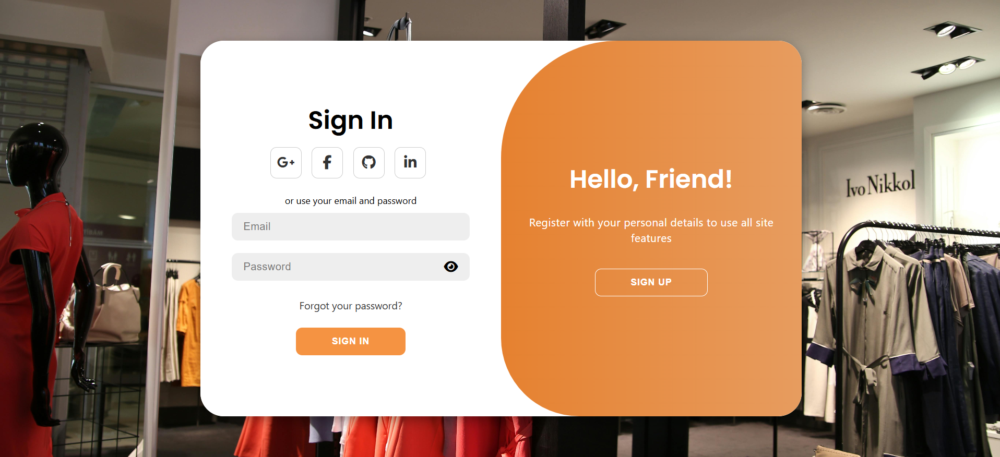

# 🛍️ FabricFusion - MERN E-Commerce App

A full-stack **E-Commerce web application** built with the **MERN stack (MongoDB, Express, React, Node.js)**.  
It allows users to browse products, search, filter by category, view detailed product pages, add to cart, and manage authentication with JWT.

---

## 🚀 Live Demo

**[View Live Website](https://fc2b3b0d-576c-496c-8f25-55101cd00dea.lovableproject.com)**

---

## ✨ Features

- 🔐 **User Authentication** (Register / Login with JWT)
- 🛒 **Add to Cart** with Redux state management
- 🔍 **Search Products** by keyword
- 📂 **Category Filtering** (Men, Women, Kids, Home & Living)
- ↕️ **Sort Products** by price (Low → High / High → Low)
- 📖 **Product Details Page** with description & add-to-cart
- 📱 **Responsive UI** (mobile-friendly, styled similar to Flipkart)
- ⚡ **Backend API** with Node.js, Express & MongoDB
- 🌐 **Deployment** (Frontend on Netlify / Vercel, Backend on Render)

---

## 🖼️ Screenshots

### 🔑 Authentication


### 🏠 Homepage


### 🔍 Search Results


---

## 🛠️ Tech Stack

### Frontend:
- ⚛️ React.js
- 🎨 CSS3 / Flexbox / Responsive Design
- 🔄 Redux Toolkit (State Management)
- 🌐 Axios (API requests)

### Backend:
- 🟢 Node.js
- 🚀 Express.js
- 🗄️ MongoDB & Mongoose
- 🔑 JWT Authentication
- 🔐 Bcrypt (Password Hashing)

### Deployment:
- 🌐 Frontend → [Vercel](https://vercel.com/)
- ⚙️ Backend → [Render](https://render.com/)
- 📦 Database → MongoDB Atlas

---

## ⚙️ Installation & Setup

### 1️⃣ Clone the repository
```bash
git clone https://github.com/your-username/fabricfusion.git
cd fabricfusion
